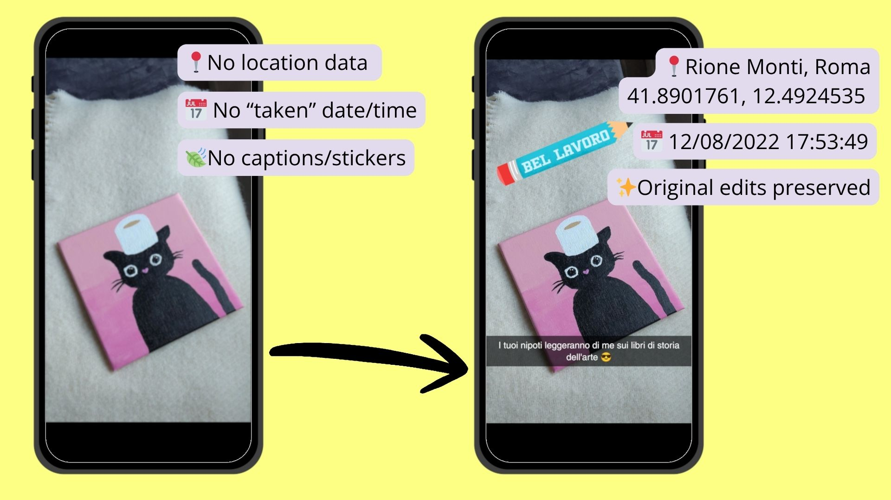

# Snapchat Memories Export Fixer



A Python GUI application to fix metadata and overlays for Snapchat memories exported as zip files.

## Problem Statement

Whether because you decided you want to move off Snapchat, or because starting from the 26th of September 2026 the free cloud space for your memories will be capped at 5GB, you might want to save all your memories (videos and pictures) and keep them somewhere else, perhaps on your phone's storage and just view them through your gallery app, or maybe on another cloud service, or a hard disk, or your computer. So you decide to simply export all of them using Snapchat's export tool. But there is a problem:

when exporting Snapchat memories, your export data is compressed in a zip file (or, likely, several, each of 2GB). Each archive contains media files with incorrect metadata:
- File "modification" time is set to export time (so good luck sorting them)
- EXIF (for images) and QuickTime (for videos) metadata lacks date/location information
- Overlay files (the text, filters or drawings you can put on top of snaps) are separate PNG files

This application extracts these files, fixes their metadata (location and date), and (optionally) merges captions, filters and stickers back into them. Then neatly saves them all on a folder of your choice (optionally separated into two folders /pictures and /videos).

## How to use

1. 🖥️ Open https://accounts.snapchat.com on a computer, login and go to "My Data"
2. ☑️ Select **both** "Export your Memories" and "Export JSON Files" (the first two)
3. 📅 Click "Next" -> Unselect "Do you want to export data from a specific date range?" or select "All Time" and check that your email is right, then hit "Submit"
4. 🕗 Wait usually a few hours, you get an email that informs you when it's ready
5. 📥 Go back to the "My Data" page, hit "View exports" to expand and download **all** the zip files.
6. 🏷️ Go to the "Releases" page on the right panel of this page and download the latest version for your platform.
7. ▶️ Extract the release file you just downloaded and run the executable inside of it (double click)
8. ✅ Click "Add files" and select **ALL** the zip files you got from the Snapchat export (CTRL+Click to select more than one)
9. 📁 Hit "Browse" to select a folder. Your memories (pictures and videos) will go directly in there
10. ❓ Choose whether you want to put the overlays (text captions, filters, stickers, etc) back into the pictures and the videos, and choose whether you want the application to create two sub-folders /videos and /pictures to separate the two.
11. 🔋 I recommend temporarily disabling sleep timeout on your device's power settings, to avoid the process getting interrupted.
12. 🖼️ Hit "Start processing" to begin processing your memories.
13. ✨ Done! The process will return a summary of the export. Your memories will be in the folder you had selected! VERIFY this before deleting the snapchat zip files, or you will have to re-download them.


## Developers area below

## Features

- **No installations or dependencies required**: the releases self-contain a Python interpreter, Exiftool binaries and other Python libraries (see credits).
- **GUI Interface with tkinter**: Ugly, but compatible and works well on all platforms
- **Metadata Correction**: Updates EXIF/QuickTime data with correct dates/location from the JSON file present in the export
- **Overlay Handling**: Optionally merges PNG overlays with media files
- **File Organization**: Outputs organized files with `snapMemory_` prefix
- **Error Handling**: Graceful handling of missing files/corrupted archives
- **Logging**: Detailed log file creation for troubleshooting

## Installation from source

### Prerequisites
- Python 3.10 or higher
- Linux-based system (tested on Ubuntu/Debian)

### Setup and usage

1. Clone or download this repository
2. Run the start script (automatically sets up virtual environment (if not found)), installs missing dependencies and starts the GUI:
   ```bash
   ./run.sh
   ```

## How It Works

1. **Extraction**: Zip files are extracted one-by-one to a temp directory, beginning with the first zip file (the one containing the JSON with the metadatas, which gets saved).
2. **Metadata Loading**: `memories_history.json` is parsed to build UUID→metadata mapping
3. **File Processing**: Each media file is:
   - Matched to its metadata via UUID in filename
   - Overlay merged (if requested)
   - **Metadata Update**: Using bundled ExifTool for both images and videos:
     - Sets correct date/time from JSON metadata
     - Adds GPS coordinates if available
     - Updates file "modification" timestamps
   - Renamed with `snapMemory_` prefix
   - Saved to appropriate output directory
4. **Cleanup**: Temporary files are removed, logs are saved

## File Structure

```
scmemoryfixer/
├── main.py              # Application entry point
├── requirements.txt     # Python dependencies
├── README.md           # This file
├── run.sh              # Development startup script
├── clean.sh            # Clean build artifacts script
├── .gitignore          # Git ignore patterns
├── build_scripts/      # Build and packaging scripts
│   ├── build_linux.sh      # Linux build script
│   ├── build_release.sh    # Release build script
│   └── *.spec              # PyInstaller spec files
├── src/                # Source code
│   ├── gui.py          # Tkinter GUI implementation
│   ├── processor.py    # Main processing logic
│   ├── metadata.py     # EXIF metadata handling
│   ├── overlay.py      # Overlay merging functionality
│   ├── utils.py        # Utility functions
│   └── exiftool_wrapper.py # ExifTool wrapper
└── exiftool/           # Bundled ExifTool binaries
    ├── Image-ExifTool-13.55/    # Linux/macOS version
    └── exiftool-13.55_64/       # Windows version
```

## Limitations

- **Large Files**: Processing large video files may be memory-intensive and could take a while, not a problem on most modern hardware

## Future Improvements

- Refine timezone metadata for files that support it (the json contains UTC datetimes)
- Add batch processing with resume capability and 
- Add dark mode theme (why not?)

## License

This project is provided as-is for personal use only, without warrany or liability from the maintainer and is licensed GNU GPL following the requirement of some of its dependencies.

## Troubleshooting

### Common Issues

1. **"Could not find memories_history.json"**: Ensure you're using the first zip file from the export
2. **"Permission denied"**: Run with appropriate permissions for output directory
3. **Large files slow processing**: The application processes files sequentially to manage memory

### Logs

Check the log file at `~/.snapmemoryfixer/snapmemoryfixer.log` for detailed error information.

### Credits

This project uses the following libraries:
- Pillow  # For image overlay operations
- opencv-python-headless  # For video overlay operations
- python-dateutil  # For date parsing
- ExifTool # most metadata processing happens thanks to ExifTool binaries directly included in the project for ease of use and portability

### Disclaimer
This project is not affiliated in any way with Snapchat or Snap Inc. Snapchat and the Snapchat logo are trademarks of Snap Inc.
